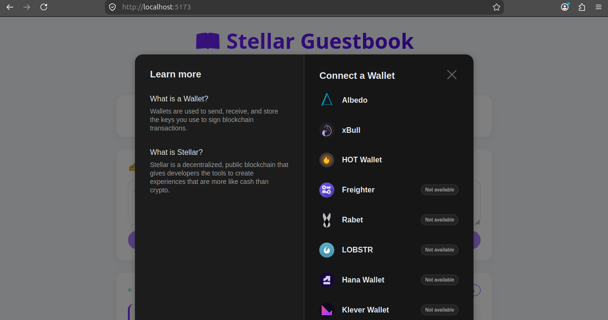

# 📖 Stellar Guestbook — Level 2

A multi-wallet, on-chain guestbook dApp built on **Stellar Soroban**. Users connect any Stellar wallet, sign a message, and it is stored on a deployed smart contract on **Stellar Testnet**.

Built for the **Stellar Journey to Mastery — Level 2**.

---

## 🎯 Level 2 Requirements Checklist

| Requirement | Status |
|---|---|
| Multi-wallet integration | ✅ Stellar Wallets Kit (Freighter, xBull, Albedo, Rabet, Lobstr, Hana, WalletConnect) |
| Contract deployed on Testnet | ✅ [`CDAP5B27FKDIPFR2ORS2OCR532VOOWRLBZTHAGXR45467427MNXBRLXC`](https://stellar.expert/explorer/testnet/contract/CDAP5B27FKDIPFR2ORS2OCR532VOOWRLBZTHAGXR45467427MNXBRLXC) |
| Contract called from frontend | ✅ `write_message` invoked via Soroban RPC |
| Transaction status visible | ✅ PENDING → CONFIRMED → SETTLED tracker |
| Real-time event handling | ✅ Soroban `getEvents` polling every 5 s |
| 3 error types handled | ✅ Wallet, network, and transaction errors |
| 10+ meaningful commits | ✅ See git history |

---

## 🚀 Live Demo

**Live URL:** _Add your Vercel / Netlify link here (optional)_

> To deploy: `npm run build` then drag the `dist/` folder into Netlify, or run `vercel` from this directory.

---

## 📸 Screenshot — Wallet Options

The Stellar Wallets Kit modal shows all supported wallets:



> **To add this screenshot:** run the app (`npm run dev`), click **Connect Wallet**, take a screenshot of the modal, save it as `screenshots/wallet-options.png` in the project root.

---

## 🔗 Deployed Contract

| Field | Value |
|---|---|
| **Network** | Stellar Testnet |
| **Contract ID** | `CDAP5B27FKDIPFR2ORS2OCR532VOOWRLBZTHAGXR45467427MNXBRLXC` |
| **WASM Hash** | `f3149a8ed93007e7f445f11967098c9ccee88a19afa15358bc979d51debb9c75` |
| **Explorer** | [View on Stellar Expert](https://stellar.expert/explorer/testnet/contract/CDAP5B27FKDIPFR2ORS2OCR532VOOWRLBZTHAGXR45467427MNXBRLXC) |

### Contract Interface

```rust
fn write_message(env: Env, author: Address, text: String) -> Result<u32, Error>
fn get_message(env: Env, id: u32) -> Result<Message, Error>
fn total_messages(env: Env) -> u32